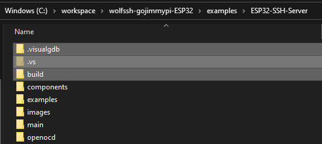
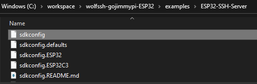
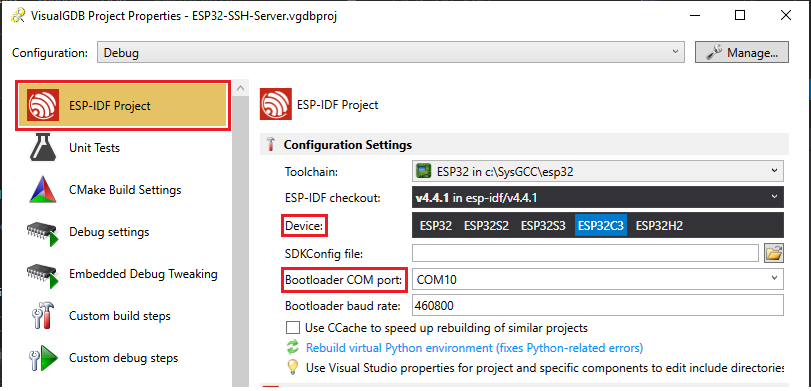
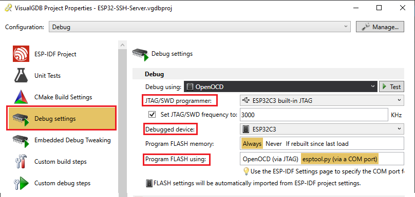
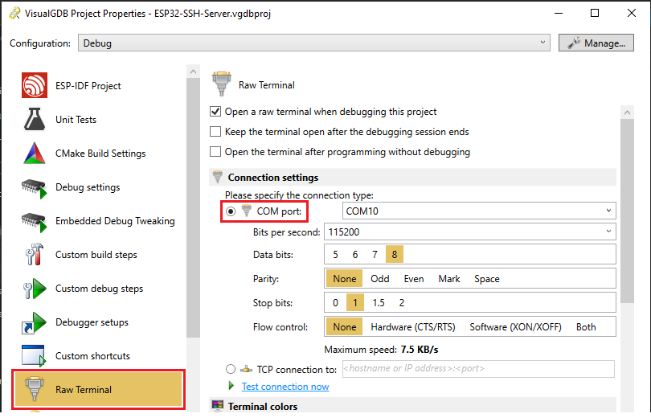

# sdkconfig options

When switching between ESP32 (Xtensa) and ESP32-C3 (RISC-V):

- Ensure Visual Studio is not running; Delete `.visualgdb` and `.vs` and `build` directories.

 
- Rename the respective `sdkconfig.ESP32` or `sdkconfig.ESP32C3` to `sdkconfig`

- Device and Bootloader COM Port:  Right-click on project, VisualGDB Properties,  ESP-IDF Project.

- Right-click on project, VisualGDB Properties. Debug Settings. JTAG/SWD Programmer = ESP32 DevKit; Debugged Device = ESP32

- Confirm desired COM port for Raw Terminal. Right-click on project, VisualGDB Properties.

## ESP32

The traditional Xtensa architecture ESP32 `sdkconfig` file can be found in 
[sdkconfig.ESP32](./sdkconfig.ESP32)

## ESP32-C3

The RISC-V architecture ESP32-C3 `sdkconfig` file can be found in 
[sdkconfig.ESP32C3](./sdkconfig.ESP32C3)

